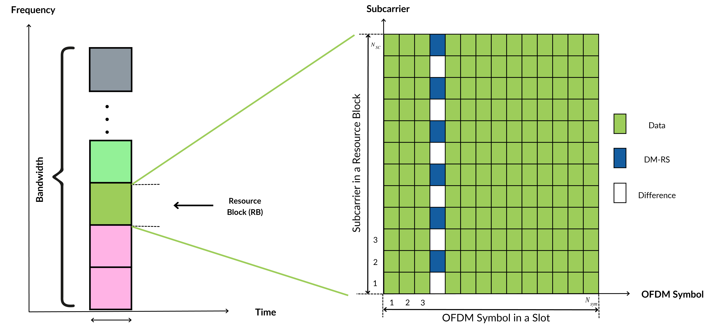
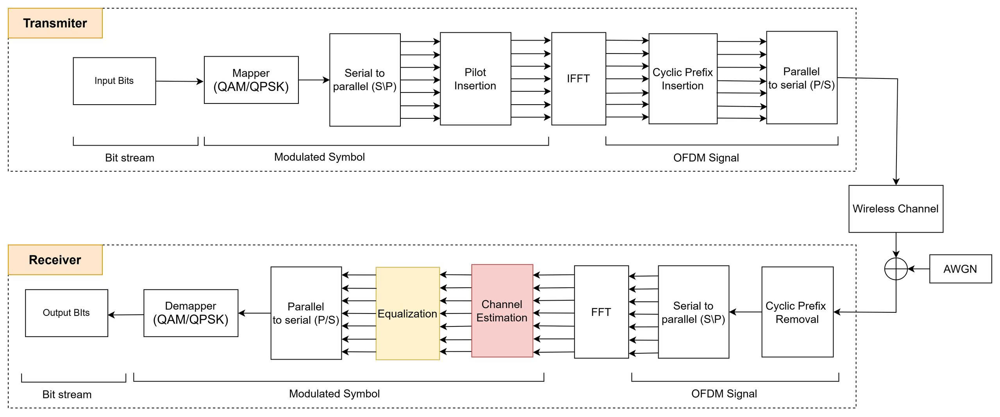

# Channel Estimation and Equalization for PUSCH

## Overview
This project focuses on the channel estimation and equalization for the Physical Uplink Shared Channel (PUSCH) in 5G NR systems. The main goal is to improve the reliability of the communication by applying algorithms like Least Square (LS), Zero Force (ZF), and Minimum Mean Square Error (MMSE). These algorithms help in estimating the channel and performing equalization to combat channel impairments such as fading and interference.

## PUSCH Grid Use Case
The PUSCH is crucial for transmitting user data in 5G networks, particularly in the uplink direction. The grid of PUSCH resource elements is designed to allocate frequency and time resources dynamically based on traffic demands. This use case simulates the allocation and estimation of channels in this uplink shared resource.

## System Model


The system model includes:
- **Transmitter Model**: Converts binary data into modulated symbols and applies appropriate pilots for channel estimation.
- **Channel Model**: A wireless channel modeled by a tapped-delay line (TDL) system, which includes multi-path fading and Doppler shifts.
- **Receiver Model**: Receives the modulated signals, removes cyclic prefixes, performs FFT to convert time-domain signals to the frequency domain, estimates the channel, and equalizes the received signal.

## Channel Estimation and Equalization Algorithms
The following algorithms are implemented to improve the performance of the PUSCH:
- **Least Square (LS)**: Direct estimation minimizing the error between the received and transmitted signals.
- **MMSE (Minimum Mean Square Error)**: A more sophisticated method that uses statistical information to reduce error in the estimation.
- **ZF (Zero Forcing)**: A simple equalization algorithm that inverts the estimated channel to recover the transmitted symbols, though it may amplify noise in low SNR conditions.

## Algorithm and Problem Description

### Problem Description
The problem at hand is channel estimation and equalization for the **Physical Uplink Shared Channel (PUSCH)** in the 5G NR system. In this system, the **PUSCH** is used for transmitting user data and control information from the User Equipment (UE) to the gNodeB (Next-generation Node B) in the uplink direction.

The channel estimation problem involves estimating the channel matrix **H** based on the observed signal **Y** and the known pilot signal **X**. The received signal **Y** is a combination of the transmitted signal **X** and noise **Z**, affected by the wireless channel characterized by the matrix **H**.

Mathematically, the received signal at the receiver can be expressed as:

$$
Y[n,m] = H[n,m] \cdot X[n,m] + Z[n,m], \quad (n,m) \in T
$$

Where:

- **\( Y[n,m] \)**: Received signal at subcarrier \( n \) and symbol \( m \).
- **\( X[n,m] \)**: Transmitted signal at subcarrier \( n \) and symbol \( m \).
- **\( H[n,m] \)**: Channel response at subcarrier \( n \) and symbol \( m \).
- **\( Z[n,m] \)**: Gaussian noise at subcarrier \( n \) and symbol \( m \).
- **\( (n,m) \in T \)**: The indices \( (n,m) \) belong to the set \( T \), which represents a valid set of signal indices.

The objective is to estimate the channel matrix **H** from the observed signal **Y** and the known pilot signal **X**. This estimated channel matrix \( \hat{H} \) is then used for equalization to recover the transmitted signal.

### Channel Estimation Algorithms

#### 1. **Least Square (LS) Estimation**
The **Least Square (LS)** estimation method directly minimizes the error between the received and transmitted signals, specifically minimizing the squared error between the observed signal and the estimated channel.

The LS estimator for the channel matrix is given by:

$$
\hat{H}_{LS}[n,m] = \frac{Y[n,m]}{X[n,m]}, \quad (n,m) \in P
$$

Where:
- \( P \) is the set of pilot indices where \( X[n,m] \) is known.
- The LS method provides a simple, closed-form solution but can perform poorly in low SNR conditions or when the channel matrix is ill-conditioned.

#### 2. **Minimum Mean Square Error (MMSE) Estimation**
The **MMSE** estimation method uses statistical information about the channel and noise to minimize the **Mean Square Error (MSE)** between the true channel **H** and the estimated channel \( \hat{H} \).

The MMSE estimator is given by:

$$
\hat{H}_{MMSE} = \mathbb{E} \left[ H | Y[n,m], (n,m) \in P \right]
$$

Using the Gaussian assumption for both the channel and noise, the MMSE estimate can be expressed as:

$$ \hat{H}_{MMSE} = R_{H,Hp} \left( R_{Hp,Hp} + \sigma^2 I \right)^{-1} Y_p $$

Where:
- **\( R_{H,Hp} \)**: Cross-covariance matrix between the full channel vector and the pilot vector.
- **\( R_{Hp,Hp} \)**: Autocovariance matrix of the pilot vector.
- **\( \sigma^2 \)**: Noise variance.
- **\( Y_p \)**: Pilot signal vector.

The MMSE method provides more accurate channel estimates compared to LS, particularly in noisy environments, but comes with higher computational complexity.

#### 3. **Zero-Forcing (ZF) Equalization**
The **Zero-Forcing (ZF)** equalization method is used to recover the transmitted signal by inverting the estimated channel matrix. This method assumes that the channel has been accurately estimated and aims to cancel out the interference caused by the channel.

The ZF equalizer is given by:

$$
\hat{X}_{ZF}[n,m] = \frac{Y[n,m]}{\hat{H}[n,m]}, \quad (n,m) \in D
$$

Where:
- \( D \) is the set of data indices.
- \( \hat{H} \): Estimated channel matrix.

While ZF is simple to implement, it can amplify noise in low SNR conditions, leading to poor performance in noisy environments.

#### 4. **MMSE Equalization**
The **MMSE equalization** method improves upon ZF by considering both the channel and the noise to reduce the overall error. The MMSE equalizer for each subcarrier is given by:

$$
\hat{X}_{MMSE}[n,m] = \frac{\hat{H}^*[n,m]}{|\hat{H}[n,m]|^2 + \sigma^2} \cdot Y[n,m]
$$

Where:
- \( \hat{H}^*[n,m] \): Complex conjugate of the estimated channel response.
- \( \sigma^2 \): Noise variance.

MMSE equalization provides better performance than ZF, especially in conditions with high noise, by balancing the trade-off between noise and channel distortion.

### Summary of Algorithms

| Algorithm | Description | Advantages | Disadvantages |
|-----------|-------------|-----------|--------------|
| **LS**    | Simple channel estimation based on minimizing squared error. | Simple, closed-form solution. | Poor performance in low SNR, ill-conditioned channels. |
| **MMSE**  | Statistical estimation method that minimizes MSE using channel statistics. | More accurate, particularly in noisy environments. | Higher computational complexity. |
| **ZF**    | Equalization method that inverts the estimated channel to recover the transmitted signal. | Simple, effective in ideal conditions. | Amplifies noise in low SNR. |
| **MMSE Equalization** | Equalization method that minimizes MSE by considering both noise and channel. | Better performance in high noise environments. | More computationally intensive. |


## Results
Simulation results show the effectiveness of channel estimation and equalization techniques in improving system performance. Key results include:
- **BER (Bit Error Rate)** improvement as the SNR (Signal to Noise Ratio) increases.
- **MSE (Mean Square Error)** reduction for the LS, ZF, and MMSE methods.
- A comparison of different modulation schemes (QPSK, 16-QAM, 64-QAM) demonstrates that MMSE outperforms other methods in terms of both BER and MSE.


Detailed charts and performance evaluations can be found in the project files.

## Installation
To get started, clone this repository:
```bash
git clone https://github.com/yourusername/Channel-Estimation-PUSCH.git
cd code
